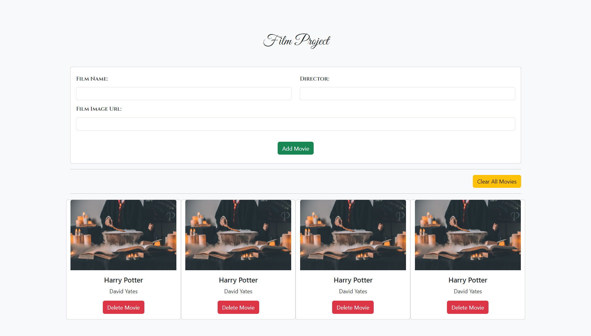

# JavaScript Movie App

This is a simple JavaScript Movie App that allows users to add, delete, clear movies. This project at the same time stores your data in the Local Storage.

## Getting Started

Clone the repository and open `index.html` in your browser.

    git clone https://github.com/yusufasur/javascript-movie-app.git

## Usage

The app allows you to perform the following actions:

-   Add a movie by typing in the input fields and pressing the `Enter` key or clicking the `Add Movie` button.
-   Delete a movie by clicking the `Delete Movie` button.
-   Clear all movies by clicking the `Clear All Movies` button.

## Built With

-   HTML
-   CSS
-   JavaScript

## License

This project is licensed under the [MIT License](https://opensource.org/license/mit/)